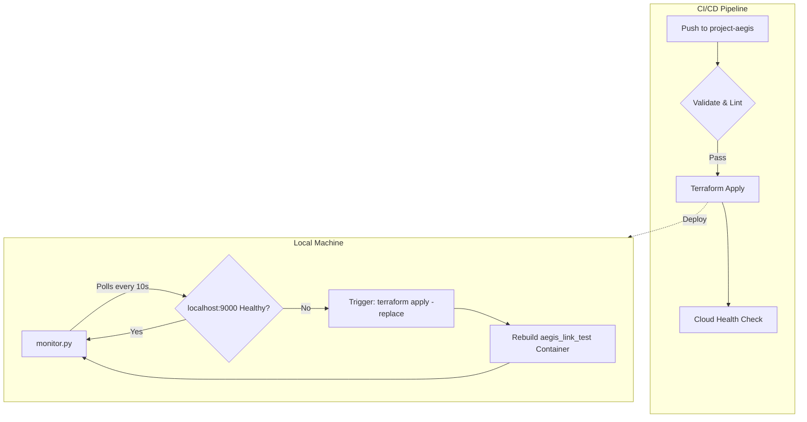

# Project Aegis: Self-Healing Infrastructure

A "Gold Standard" DevOps pipeline featuring automated infrastructure deployment, continuous integration, and a local self-healing monitoring loop.

## 🚀 System Architecture
This diagram illustrates the self-healing loop and CI/CD flow we've established as of Tuesday, June 16, 2026.



## 🛠 Features
- **IaC with Terraform:** Manages a Dockerized Nginx web server with specific resource limits (Memory/CPU).
- **CI/CD Pipeline:** GitHub Actions workflow that performs validation, linting, and automated deployment.
- **Self-Healing Loop:** A Python-based monitoring script (`monitor.py`) that detects service failures and triggers a `terraform apply -replace` to automatically rebuild unhealthy resources.

## 📂 Project Structure
- `main.tf`: Terraform configuration for the Docker provider and Nginx container.
- `monitor.py`: Python script for local health monitoring and automated recovery.
- `.github/workflows/deploy.yml`: The CI/CD pipeline definition.

## 🚦 Getting Started

### Prerequisites
- Docker Desktop
- Terraform CLI
- Python 3.12+

### Local Setup
1. **Clone and Sync:**
   ```bash
   git checkout project-aegis
   git pull origin project-aegis
   ```
2. **Launch Infrastructure:**
   ```bash
   terraform init
   terraform apply -auto-approve
   ```
3. **Start the Monitor:**
   ```bash
   python monitor.py
   ```

## 🛡 Health Check & Recovery
The system monitors `http://localhost:9000`. If the container is stopped or the service fails, the monitor triggers:
```bash
terraform apply -replace="docker_container.aegis_link_test" -auto-approve
```
This ensures zero-intervention recovery for critical services.
